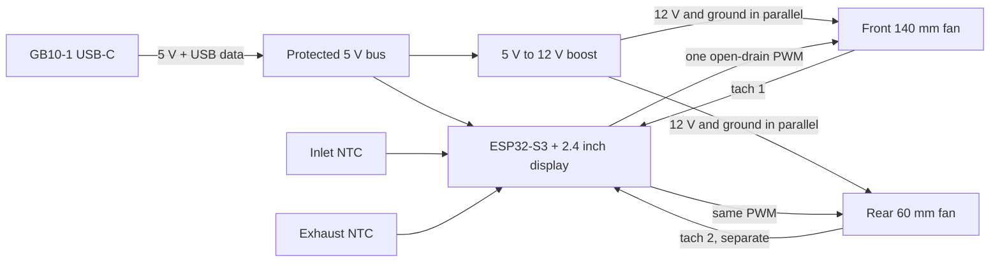

# Controller Architecture

Status: telemetry topology, one-channel fan control, and dual-input power strategy approved; GB10 host-port output remains pending physical validation.

## Approved telemetry topology

- Install a lightweight Linux telemetry service on both GB10 units.
- GB10-1 is the controller host and connects to an ESP32-S3 over USB serial.
- GB10-1 reads its local temperatures and obtains GB10-2 telemetry over the local network.
- GB10-1 sends combined telemetry and control policy updates to the ESP32-S3.
- The ESP32-S3 drives the local 2.4-inch display and one shared four-pin PWM control signal for both fans.
- Loss of USB, network telemetry, or either service triggers a controller-local conservative fallback fan speed.

## Approved fan interface

- Use one 25 kHz open-drain PWM output for the front 140 mm intake fan and rear 60 mm exhaust-assist fan.
- Use the fans' daisy-chain connectors where available: 12 V, ground, and PWM are shared. Electrically, both fan motors remain connected in parallel to 12 V; they must not be wired in series.
- Implement PWM with one external open-drain transistor, not a push-pull ESP32 GPIO. ESP32 reset or loss of controller power must release the PWM line so compliant four-wire fans default to full speed.
- Do not join the tachometer outputs. Connect the front-fan tachometer to a dedicated ESP32-S3 input and retain a second, separate input for the rear fan so either stalled fan can be identified.
- Both fans follow the same commanded duty cycle. The minimum allowed duty and startup boost must satisfy the less tolerant of the two physical fans.
- On startup, command 100% duty for a short spin-up interval, then apply the temperature curve. On missing telemetry or an invalid local sensor, use the controller-local conservative duty. On a confirmed fan stall, command 100% and show an audible/visible fault.

## Initial control policy for bench tuning

- Spin-up: 100% PWM for 3 seconds whenever fan power is applied.
- Normal host curve: 30% at or below 45 degrees C, linear to 70% at 65 degrees C, linear to 100% at 75 degrees C, and 100% above that.
- Local exhaust curve: 30% at or below 30 degrees C, linear to 100% at 45 degrees C, and 100% above that.
- Command the higher duty requested by the host-temperature and local-exhaust curves, then clamp it to the measured stable minimum duty of the less tolerant fan.
- Use 2 degrees C hysteresis and limit ordinary speed changes to 10 percentage points per second. Emergency and stall responses bypass the ramp limit.
- Treat host telemetry older than 10 seconds as invalid and fall back to the local sensors. If both local sensors are invalid, command 100%.
- After the 3-second startup interval, a tachometer below its measured valid threshold for 2 seconds triggers one 100% restart attempt and then a persistent fan-fault indication.

These values are conservative prototype defaults, not final thermal limits. Tune them only after logging both GB10 temperatures, inlet/exhaust temperature, PWM duty, and RPM under idle and sustained load.

## Display content

- GB10-1 and GB10-2 temperature with per-field validity.
- Inlet and exhaust temperatures.
- Shared fan duty and separate front/rear RPM when both tachometer inputs are fitted.
- USB/Wi-Fi telemetry state, power-source state, and fan/sensor faults.
- Use the display module's capacitive touch for page switching and settings; omit the separate rotary encoder and its enclosure hole unless bench use shows a real need.

## Preliminary power budget

- Supplied 140 mm fan: 12 V x 0.22 A. Delta AFB0612LB rear-fan candidate: 12 V x 0.10 A. Combined rated running load is approximately 3.84 W.
- ESP32-S3, display, sensors, and conversion losses add approximately 1.5-2.0 W.
- Fan startup current and boost-converter derating still require measurement; provision a 12 V rail rated for at least 1 A and a protected 5 V source rated for at least 2 A.
- The official GB10 white paper does not specify the source-current capability of the three USB-C/DisplayPort host ports.
- Do not tap or split the GB10 48 V / 5 A PD input without a separately validated EPR-rated power design.

## Required safety behavior

- Controller-local PWM fallback independent of host software, with released-PWM full-speed behavior if the ESP32 resets.
- Separate front and rear fan tachometer monitoring and stalled-fan alarm; never parallel tachometer outputs.
- Power input protection against reverse current and accidental dual-source backfeed.
- Optional alternate USB-C power input is recommended until GB10 host-port output capability is measured.

## Approved power-input strategy

- Primary input: one GB10-1 USB-C host port for 5 V power plus USB serial communication, subject to measured current capability.
- Alternate input: a dedicated external USB-C 5 V or 9 V supply connection.
- Use a protected power multiplexer or ideal-diode arrangement so the two inputs are mutually isolated and cannot backfeed each other.
- The enclosure and controller PCB remain unchanged if testing requires operation from the alternate input.
